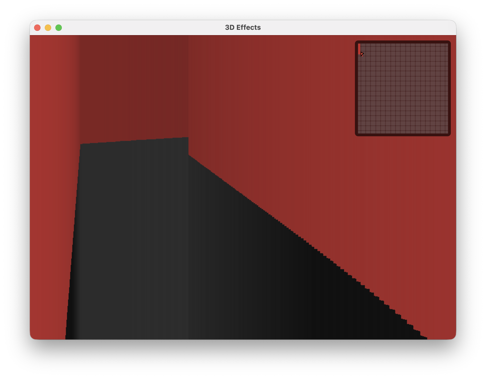
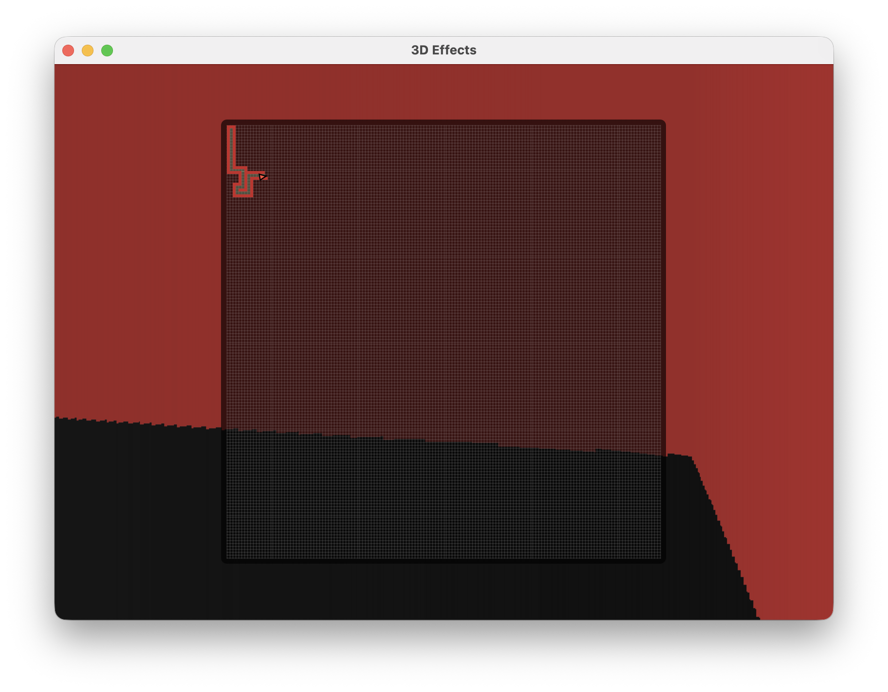
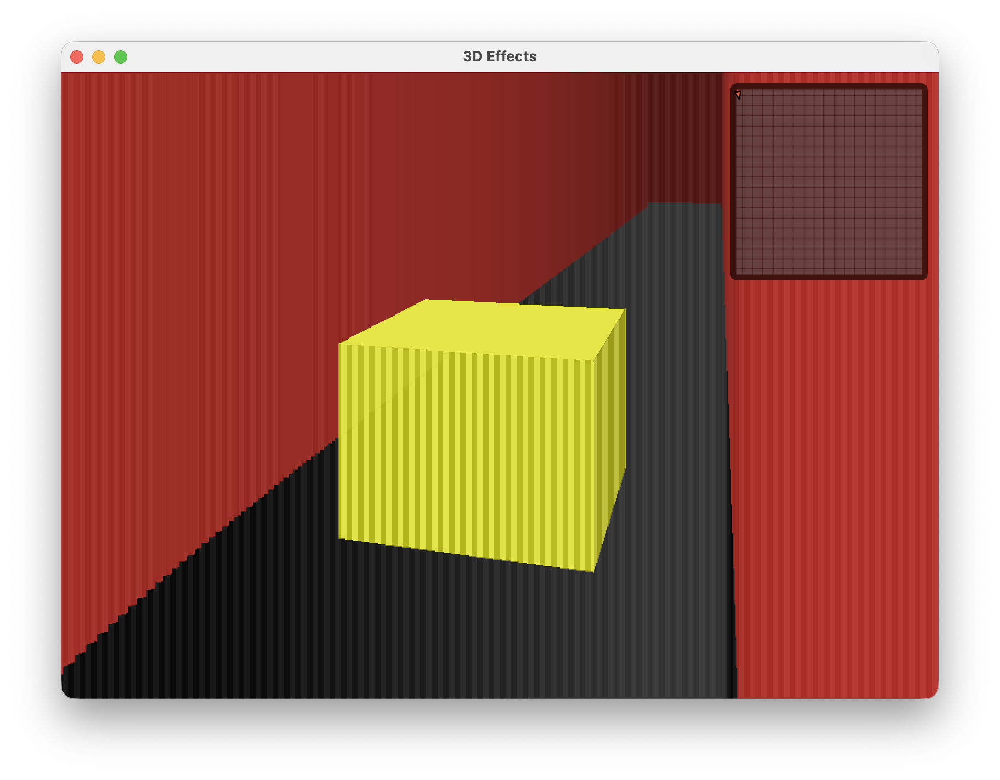

# Doom Java: 2D Engine with 3D Effects

This project simulates a classic Doom-like 3D effect using 2D drawing tools in Java. It features a customizable map, a mini map for navigation, and collectable objects, all rendered in a retro style.

## Features

- **2D Engine with 3D Simulation:** Uses 2D graphics to create a pseudo-3D first-person experience.

- **Map Storage:** Maps are stored as text files in the `mapStorage` directory. Each number represents a color or wall type (0 is reserved for the floor).
- **Mini Map:** Shows explored paths. Click to enlarge or close the mini map for better navigation.

- **Collectable Objects:** Items appear in the scene and can be collected. Collected items disappear from the map and are stored in the player's bag (an ArrayList).

- **Customizable Levels:** Easily modify or add new maps by editing or adding files in `mapStorage`.

## Getting Started

### Prerequisites

- Java Development Kit (JDK) 8 or higher
- A Java IDE or the ability to run Java files from the command line

### Setup

1. **Clone the repository:**
	```sh
	git clone <repo-url>
	cd 3D_Effect_Java
	```
2. **Open the project in your IDE** or navigate to the project directory in your terminal.

3. **Map Files:**
	- Maps are stored in `mapStorage/` as `.txt` files (e.g., `DefaultMaze.txt`).
	- Each number in the file represents a tile type or color. 0 is always the floor.

## Running the Game

1. **Compile the source files:**
	```sh
	javac src/*.java
	```
2. **Run the game:**
	```sh
	java -cp src Game
	```
	- By default, the game loads the default maze from `DefaultMaze.txt`.
	- To use a different map, change the file name in `GraphStorage.java` or add new map files to `mapStorage/`.

## File Structure

```
Readme.md
mapStorage/
	 DefaultMaze.txt
src/
	 CollectableObject.java
	 Collection.java
	 Game.java
	 GraphStorage.java
	 KeyBoard.java
	 MainPanel.java
	 MapPanel.java
	 UI.java
```

## Code Overview

- **Game.java:** Main entry point. Handles game loop and initialization.
- **GraphStorage.java:** Loads and manages map data from text files.
- **MapPanel.java:** Renders the main game view and handles 2D/3D drawing.
- **MainPanel.java:** Manages the main UI and game panels.
- **UI.java:** Handles user interface elements and overlays.
- **KeyBoard.java:** Processes keyboard input for player movement and actions.
- **CollectableObject.java / Collection.java:** Define and manage collectable items.

## Customizing the Game

- **Editing Maps:**
  - Open any `.txt` file in `mapStorage/` and edit the numbers to change the map layout.
  - Add new files for additional levels.
- **Changing the Default Map:**
  - In `GraphStorage.java`, modify the file name to load a different map at startup.

## Controls

- Use the keyboard to move and interact with the environment.
- Click the mini map to enlarge or close it.


